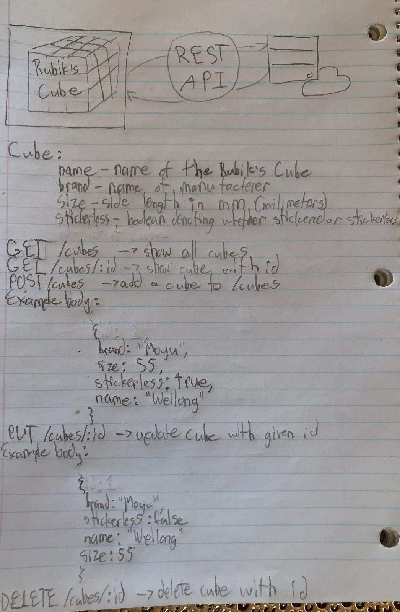

# Rubik's Cube REST API Overview
This is an overview of a simple Rubik's Cube REST API I've designed after learning about API's and the REST paradigm.

Additions:
- Add a PATCH operation when fields of existing resources need to be updated
- Authentication when creating a database for users to see what cubes they have
- Validation to ensure size is a positive number
- Add the ability to filter for certain fields

